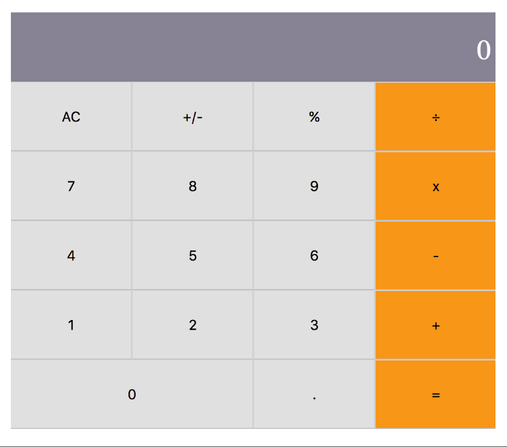

<h1 align="center"> Magicians Calculator </h1>

> Math-magicians is a fictional company based in France. They have requested a fully-functional MVC product that would assist them with their calculations.

> The application should be developed using React Framework and NPM. 

### You can access a Live Demo [HERE](https://magician-calculator.herokuapp.com/)

## Required Interface

## Development

### #1 Milestone Requirements:
 - Initiate Documentation
 - Initiate React Application
 - Install main dependencies
 - Deploy the application

### #2 Milestone Requirements
  - Build Components: App, Display, ButtonPanel and Button
  - App renders Display and ButtonPanel
  - Display receives result and result has its validations and default
  - Button receives name and name has its validations
  - ButtonPanel renders groups of Buttons

### #4 Milestone Requirements
  Calculate

  - Create a calculate method to process the data
  - Add functionalities for buttons ('AC ', '=', '+/-' and math operators)
  - Use the operate method to make an operation when the sentence is completed.

  Operate

  - Create a method for the basic operations
  - Use Big.js to operate big numbers

  
  - Import calculate to App component

### #5 Milestone Requirements

  Event Handler

  - Calculate logic should work perfectly with buttons interaction
  - App is a stateful class Component
  - Build Handler Method to add button functionality
  - Use calculate logic to set the state of App attributes
  - HandleClick is Button Prop and a ButtonPanel prop
  - Prop HandleClick is attach as an onCLick Event at Buttons Components.

### Refactoring to use Hooks

## Built With

- Javascript
- React Framework
- NPM

## Prerequisites

- Using NPM package and JavaScript knowledge to run and make changes in that project.
- You should install Node.js to run the server with the dependency used. If you don't have Node you can follow this tutorial to set it on your local machine: [HERE](https://www.w3schools.com/nodejs/default.asp)

## Getting Started

To get a local copy of this project running follow these simple steps.

- Clone this repository
 > `git clone <repo>`
- Navigate to the Repo Folder
- To set Webpack and the dependencies run the command
> `npm install`
- Use the command below to start the server. 
> `npm start`
- Use your favorite browser to open http://localhost:3000 to view it in the browser.

## Testing

This repo contains files to test the application logic and components.
You can run the following command on your terminal to run the tests.

> ` yarn test`

or customize them changing the files inside the src/__tests __ folder.

## Authors

👤 **Marilena Roque**

- Github: [MarilenaRoque](https://github.com/MarilenaRoque)
- Twitter: [@MariRoq88285995](https://twitter.com/MariRoq88285995)
- Linkedin: [roquemarilena](https://www.linkedin.com/in/roquemarilena/)

## 🤝 Contributing

Contributions, issues and feature requests are welcome!

Feel free to check the [issues page](issues/).

## Show your support

Give a ⭐️ if you like this project!
